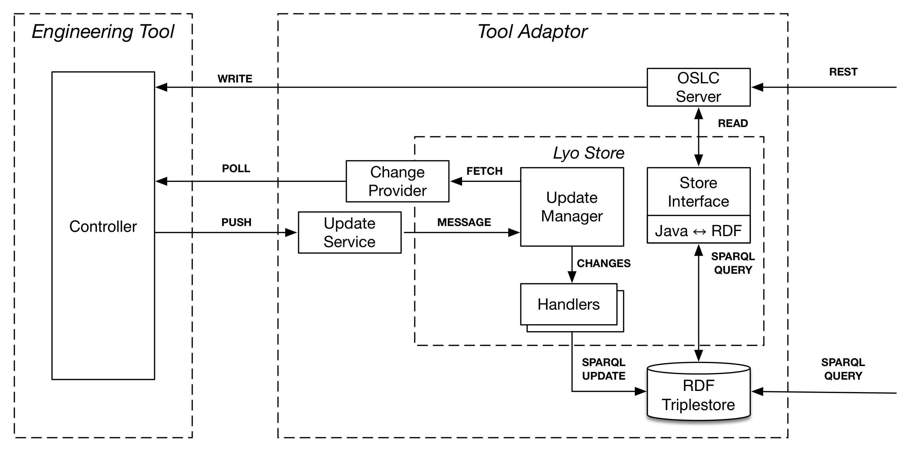

# Lyo Store

*Lyo Store* is a library that provides a simple interface for working with a
triplestore via Java objects representing OSLC Resources.

## Introduction

Lyo Store makes use of the Jena Framework API (through the Eclipse Lyo Jena
helper) to interact with any RDF Triplestore that can provide a SPARQL endpoint
over HTTP.

An OSLC Server interacts with Lyo Store using on instances of OSLC4J-annotated
classes, which are expected to represent the business objects of the underlying
lifecycle tool. *This allows the Server components to work generically with any
tool Controller, while at the same time being able to handle tool-specific
domain objects.* When interacting with the RDF TripleStore, Lyo Store eventually
marshals/unmarshals such instances into an RDF graph, through the available
OSLC4J helper methods.

So naturally, all components of this architecture need to share the common set
of OSLC4J-annotated classes. To facilitate this effort, the adaptor developer
can take advantage of the [OSLC Lyo Modelling
tool](https://wiki.eclipse.org/Lyo/ToolchainModellingAndCodeGenerationWorkshop)
in order to graphically model the business objects to be exposed, as well as the
services of the OSLC Server component. From such a model, the classes and
services can be generated.



## Getting started

Lyo uses Maven as a primary choice for the build system. Make sure your POM file
includes Eclipse Maven repositories (see the [OSLC4J
instructions](https://wiki.eclipse.org/Lyo/LyoOSLC4J#Using_in_Maven)).

Add the following dependency:

```xml
<dependency>
  <groupId>org.eclipse.lyo.tools</groupId>
  <artifactId>lyo-store</artifactId>
  <version>2.2.0-SNAPSHOT</version>
</dependency>
```

**NOTE!** If you are using the older versions of Lyo (2.1.2 and lower), Maven might decide to use an incompatible version of Jena. In order to prevent this, enforce the Jena version used by `lyo-store` by adding the following tag to the `pom.xml`:

```xml
<dependencyManagement>
    <dependencies>
        <dependency>
            <groupId>org.apache.jena</groupId>
            <artifactId>jena-core</artifactId>
            <version>2.13.0</version>
        </dependency>
    </dependencies>
</dependencyManagement>
```

Now you are all set to start using the library. If you encounter any API
questions along the way, consult the [Javadoc][javadoc] or ask a question on the
[Lyo forum][forum].

## Using Lyo Store

Assuming you have initialised an array of resource class instances in variable
`resourceArray`, in order to add the new resources and overwrite the existing
ones you can use the following flow:

```java
try {
    store.updateResources(GRAPH_NAME, // URI of the named graph
            resourceArray);           // an array of OSLC Resources
} catch (StoreAccessException e) {
    logger.error("Error executing a query on a triplestore");
}
```

In order to retrieve the resources of type `Requirement` from the triplestore in
batches of 200:

```java
if (store.namedGraphExists(GRAPH_NAME)) {
    try {
        final int limit = 200; // fetch 200 resources
        final int offset = 0;  // start with the first page
        // 'limit+1' is a technique that allows you to determine if there are
        // more results on the next page
        List<Requirement> requirements = store.getResources(GRAPH_NAME,
                Requirement.class, // resources of this class will be fetched and unmarshalled
                limit + 1,         // resource limit
                offset));          // how many resources to skip, use for paging
    } catch (StoreAccessException e) {
        logger.error("Error executing a query on a triplestore");
    } catch ( ModelUnmarshallingException e) {
        logger.error("Error unmarshalling the RDF from triplestore into Requirement class instances");
    }
}
```

See [Store
javadoc](http://assume.gitlab.io/jena-cache/apidocs/org/eclipse/lyo/tools/store/Store.html)
for all available methods.

## Links

* **[Lyo Store Javadoc][javadoc]**
* [File a new Lyo Tools bug](https://bugs.eclipse.org/bugs/enter_bug.cgi?product=Lyo&component=Tools)
* [Ask a question on Eclipse Lyo forum][forum]
* **[Contribute to Eclipse Lyo!](https://wiki.eclipse.org/Lyo#Contributing_to_Lyo)**

[javadoc]: http://assume.gitlab.io/jena-cache/apidocs/overview-summary.html
[forum]: https://www.eclipse.org/forums/index.php/f/228/